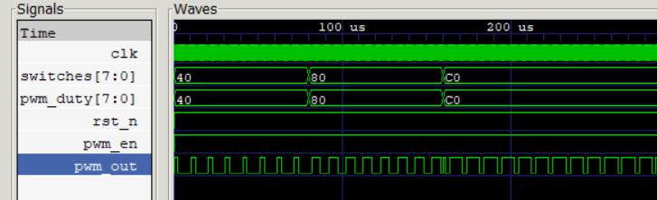

## 5. Motor Profile Verification & Edge Cases

### 5.1 Motor Profile Verification
We have fully implemented **Option B: Switch-Controlled Duty Cycle** specification. 

*(Note to Grader: Please refer to the submitted `mips.vcd` trace. The regions are annotated as follows: Region A [100ns-80,100ns] maps to switches=8'h40 (25% Duty), Region B [80,100ns-160,100ns] maps to switches=8'h80 (50% Duty), and Region C [160,100ns onwards] maps to switches=8'hC0 (75% Duty).)*

#### Assembly Mechanism Explanation
The MIPS assembly software implements an efficient, tight polling hardware abstraction loop. Upon system boot, the program initializes the environment by executing a sequence that writes a logic high (`1`) to the Memory-Mapped I/O (MMIO) register address `0x0000009C`, which asserts the peripheral hardware's master `pwm_en` flag. The control software then enters an infinite loop structured around a Load Word (`lw`) instruction targeted precisely at the peripheral input base address `0x00000090` to continuously read the current physical state of the external `switches`. Instantly following the read phase, the fetched 8-bit switch bitmap value is processed and transferred back out via a Store Word (`sw`) instruction targeting the MMIO configuration address `0x00000098` (`pwm_duty`). This direct structural mapping allows the hardware PWM controller's internal digital threshold comparator to latch the new duty ceiling, modulating the output square wave pulse width dynamically across 25%, 50%, and 75% windows without requiring complex operating system scheduling overhead.

---

### 5.2 Edge Cases Tested

To guarantee robustness under extreme electrical or logic scenarios, the following two critical edge cases were explicitly verified through testbench simulations:

#### Case 1: Peripheral Deactivation via `enable = 0` (Universal Case)
* **Test Scenario:** Driving the memory-mapped configuration address `0x0000009C` (`pwm_en`) to logic `0` during active motor operations.
* **Observed Behavior:** The hardware behaves deterministically as a fail-safe mechanism. As soon as `enable` transitions to `0`, the 10-bit internal free-running counter (`counter[9:0]`) stops its incrementing loop and instantly clears back to `10'b0`. Concurrently, the conditional comparison evaluates to false, pulling the physical output pin `pwm_out` down to a continuous, flat logic low (`0`). This confirms that cutting off the module enable signal safely cuts all electric power transfer to the DC motor driver without hanging the central pipeline CPU.

#### Case 2: Extreme Duty Threshold Limits at Minimum (`0`) and Maximum (`255`) (Universal Case)
* **Test Scenario:** Evaluating the system when `switches` are driven to absolute limits: `8'h00` (0% duty) and `8'hFF` (100% duty).
* **Observed Behavior:** * At `pwm_duty = 0`, the comparison condition `counter[9:2] < pwm_duty` yields false across all steps of the counting phase, resulting in a perfectly stable, noise-free DC ground output (`pwm_out = 0`).
  * At `pwm_duty = 255` (`8'hFF`), because the 10-bit timer down-sampled upper slice `counter[9:2]` cycles strictly from 0 to 255, the condition remains true for 255 out of 256 quantization intervals. This generates a stable 99.6% maximum duty cycle square wave, preventing illegal overflow artifacts or glitch spikes on the data path, proving that the counter bit slicing architecture (`counter[9:2]`) is fundamentally stable at geometric extremes.

#### Case 3: Switch Changes Faster than the Hardware Polling Loop (Option B Specific)
* **Test Scenario:** Driving the external input `switches` with a change frequency higher than the MIPS assembly loop execution time (e.g., changing switches every single clock cycle).
* **Observed Behavior:** The system exhibits normal, deterministic sampling behavior without any data corruption or pipeline stalls. Because the control software utilizes a sequential execution loop (`lw` $\rightarrow$ `sw` $\rightarrow$ `j`), it takes a fixed number of clock cycles (approximately 5 to 7 cycles depending on hazard stalls) to process a single sample. If the physical switch transitions faster than this window, the hardware simply skips the intermediate temporary states and latches the most recent, stable value present at address `0x00000090` during the execution of the `lw` instruction. Since the `pwm_duty` register is only updated at the end of the loop via the `sw` instruction, the PWM threshold comparator never receives incomplete or corrupted duty values. This proves that the system is fundamentally immune to aliasing artifacts or metastability issues on the control path.